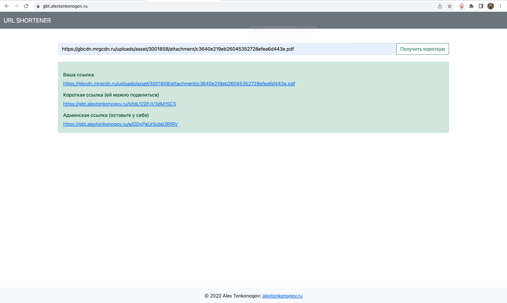
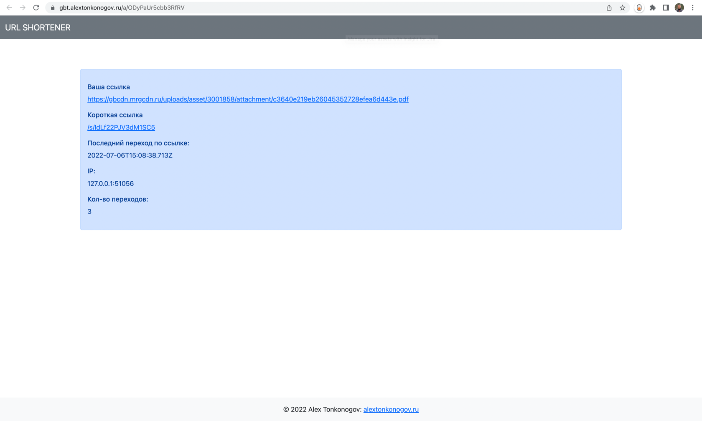
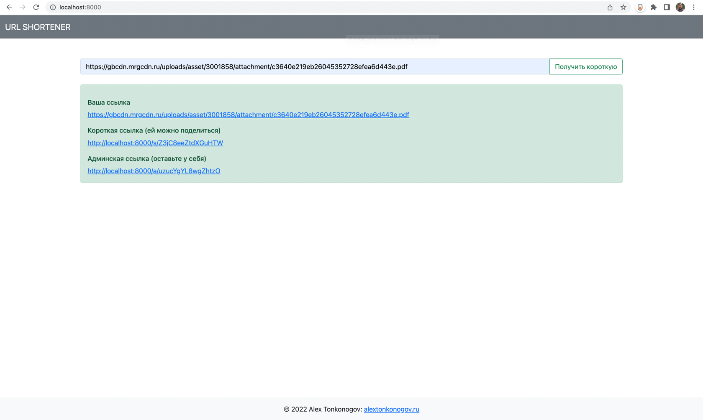

# Курсовой проект URL Shortener

## Описание работы сервиса

- При заходе на стартовую страницу (эндпоинт `/`) видим форму с одним полем для ввода длинной ссылки и кнопку для ее отправки.
- Указываем ссылку и нажимаем на кнопку.
- Без перезагрузки страницы запрос улетает на сервер, обрабатывается и возвращает JSON c результатом.
- Фронт обрабатывает JSON и в специальном div формирует HTML контент: исходная ссылка, короткая ссылка и админская ссылка.
- Если переходим по короткой ссылке и она существует в БД, то сервер перенаправит на длинную.
- При каждом переходе по короткой ссылке в БД фиксируется время, IP и инкрементируется счетчик посещений.
- Если переходим по админской ссылке и она существует в БД, то сервер сгенерирует статистику и вернет JSON, который на лету обработает фронт и сгенерирует HTML
- Если в короткой ссылке сделать ошибку (убрать или добавить символы), то сервер перенаправляет на специальную страницу с ошибкой (эндпоинт `/err`). На неверные админские ссылки возвращается JSON с ошибкой, перенаправление на эндпоинт `/err` ложится на логику фронта. 

В качестве фронтенд был использован bootstrap и дополнительно написан простой JS код. Авторизацию не добавлял умышленно, хотя умею - сама логика сервиса не предполагает ее наличие, как мне кажется.

Постарался реализовать возможность работы по REST API, чтобы удобно было тестировать и использовать в связке с другими клиентами: бот, мобильное приложение, Postman и тд. Описание с примерами будет в конце.

Текущая версия проекта развернута у меня на сайте (платформа NetAngels) - [gbt.alextonkonogov.ru](https://gbt.alextonkonogov.ru/)





Также есть возможность запуститься локально через Docker Compose.



Тесты планирую добавить завтра.
Код в ветке final_v: https://github.com/alextonkonogov/gb-go-url-shortener/tree/final_v

---
#### СОЗДАНИЕ
Отправляем JSON методом POST на эндпоинт `/s/create`

**Запрос:**
```shell
curl --location --request POST 'http://localhost:8000/s/create' \
--header 'Content-Type: application/json' \
--data-raw '{
    "long":"https://gbcdn.mrgcdn.ru/uploads/asset/3001858/attachment/c3640e219eb26045352728efea6d443e.pdf"
}'
```

**Ответ:**

Если все ок:
```shell
{
    "id": 4,
    "created": "2022-07-10T03:16:29.101Z",
    "long": "https://gbcdn.mrgcdn.ru/uploads/asset/3001858/attachment/c3640e219eb26045352728efea6d443e.pdf",
    "short": "w9fio2NI7hGLZ6XX",
    "admin": "g53tUw73xehbhC1I"
}
```

Если пустой JSON
```shell
{
"status": "Invalid request.",
"error": "render: unable to automatically decode the request content type"
}
```

Если URL невалидный:
```shell
{
"status": "Invalid request.",
"error": "invalid URL"
}
```

---
#### ЧТЕНИЕ (короткой ссылки)
GET запрос на эндпоинт `/s/{short}` с коротким кодом в составе пути

**Запрос:**
```shell
curl --location --request GET 'http://localhost:8000/s/w9fio2NI7hGLZ6XX'
```

**Ответ:**
Редирект либо на длинную ссылку, либо на страницу с ошибкой (эндпоинт `/err`)

---
#### ЧТЕНИЕ (админской ссылки)
POST запрос на эндпоинт `/a` с JSON содержимым. В ответ получим JSON со статистикой

**Запрос:**
```shell
curl --location --request POST 'http://localhost:8000/a' \
--header 'Content-Type: application/json' \
--data-raw '{
    "admin":"g53tUw73xehbhC1I"
}'
```

**Ответ:**

Если все ок:
```shell
{
    "ip": "172.28.0.1:56220",
    "viewed": "2022-07-10T03:20:15.403Z",
    "count": 3,
    "long": "https://gbcdn.mrgcdn.ru/uploads/asset/3001858/attachment/c3640e219eb26045352728efea6d443e.pdf",
    "short": "w9fio2NI7hGLZ6XX",
    "admin": ""
}
```
Если отправим пустой JSON:
```shell
{
"status": "Invalid request.",
"error": "render: unable to automatically decode the request content type"
}
```
Если укажем неверный код админа:
```shell
{
"status": "Resource not found.",
"error": "error when reading: read statistics error: sql: no rows in result set"
}
```
---
## Тесты

Для запуска интеграционного тестирования запустим docker compose

```shell
a.tonkonogov@admins-MacBook-Pro gb-go-url-shortener % docker compose up
[+] Running 4/4
 ⠿ Network gb-go-url-shortener_url_shortenernet  Created                                                                                                                                                                          0.0s
 ⠿ Container postgres                            Created                                                                                                                                                                          0.1s
 ⠿ Container registry                            Created                                                                                                                                                                          0.1s
 ⠿ Container url_shortener                       Created                                                                                                                                                                          0.1s
Attaching to postgres, registry, url_shortener
registry       | time="2022-07-10T22:52:20.576287925Z" level=warning msg="No HTTP secret provided - generated random secret. This may cause problems with uploads if multiple registries are behind a load-balancer. To provide a shared secret, fill in http.secret in the configuration file or set the REGISTRY_HTTP_SECRET environment variable." go.version=go1.16.15 instance.id=3d640ef2-6ea3-4ef5-9486-66124dfcd173 service=registry version="v2.8.1+unknown" 
registry       | time="2022-07-10T22:52:20.576381384Z" level=info msg="redis not configured" go.version=go1.16.15 instance.id=3d640ef2-6ea3-4ef5-9486-66124dfcd173 service=registry version="v2.8.1+unknown" 
registry       | time="2022-07-10T22:52:20.577487384Z" level=info msg="Starting upload purge in 50m0s" go.version=go1.16.15 instance.id=3d640ef2-6ea3-4ef5-9486-66124dfcd173 service=registry version="v2.8.1+unknown" 
registry       | time="2022-07-10T22:52:20.585317467Z" level=info msg="using inmemory blob descriptor cache" go.version=go1.16.15 instance.id=3d640ef2-6ea3-4ef5-9486-66124dfcd173 service=registry version="v2.8.1+unknown" 
registry       | time="2022-07-10T22:52:20.589895259Z" level=info msg="listening on [::]:5000" go.version=go1.16.15 instance.id=3d640ef2-6ea3-4ef5-9486-66124dfcd173 service=registry version="v2.8.1+unknown" 
postgres       | The files belonging to this database system will be owned by user "postgres".
postgres       | This user must also own the server process.
postgres       | 
postgres       | The database cluster will be initialized with locale "en_US.utf8".
postgres       | The default database encoding has accordingly been set to "UTF8".
postgres       | The default text search configuration will be set to "english".
postgres       | 
postgres       | Data page checksums are disabled.
postgres       | 
postgres       | fixing permissions on existing directory /var/lib/postgresql/data ... ok
postgres       | creating subdirectories ... ok
postgres       | selecting dynamic shared memory implementation ... posix
postgres       | selecting default max_connections ... 100
postgres       | selecting default shared_buffers ... 128MB
postgres       | selecting default time zone ... Etc/UTC
postgres       | creating configuration files ... ok
postgres       | running bootstrap script ... ok
postgres       | performing post-bootstrap initialization ... ok
postgres       | syncing data to disk ... ok
postgres       | 
postgres       | 
postgres       | Success. You can now start the database server using:
postgres       | 
postgres       |     pg_ctl -D /var/lib/postgresql/data -l logfile start
postgres       | 
postgres       | initdb: warning: enabling "trust" authentication for local connections
postgres       | You can change this by editing pg_hba.conf or using the option -A, or
postgres       | --auth-local and --auth-host, the next time you run initdb.
postgres       | waiting for server to start....2022-07-10 22:52:21.346 UTC [47] LOG:  starting PostgreSQL 12.11 (Debian 12.11-1.pgdg110+1) on aarch64-unknown-linux-gnu, compiled by gcc (Debian 10.2.1-6) 10.2.1 20210110, 64-bit
postgres       | 2022-07-10 22:52:21.348 UTC [47] LOG:  listening on Unix socket "/var/run/postgresql/.s.PGSQL.5432"
postgres       | 2022-07-10 22:52:21.375 UTC [48] LOG:  database system was shut down at 2022-07-10 22:52:21 UTC
postgres       | 2022-07-10 22:52:21.384 UTC [47] LOG:  database system is ready to accept connections
postgres       |  done
postgres       | server started
url_shortener  | time="2022-07-11 01:52:21" level=error msg="err when pinging: failed to connect to `host=postgres user=postgres database=test`: dial error (dial tcp 192.168.32.3:5432: connect: connection refused)"
url_shortener  | time="2022-07-11 01:52:21" level=fatal error="failed to connect to `host=postgres user=postgres database=test`: dial error (dial tcp 192.168.32.3:5432: connect: connection refused)"
postgres       | CREATE DATABASE
postgres       | 
postgres       | 
postgres       | /usr/local/bin/docker-entrypoint.sh: ignoring /docker-entrypoint-initdb.d/*
postgres       | 
postgres       | 2022-07-10 22:52:21.624 UTC [47] LOG:  received fast shutdown request
postgres       | waiting for server to shut down....2022-07-10 22:52:21.625 UTC [47] LOG:  aborting any active transactions
postgres       | 2022-07-10 22:52:21.626 UTC [47] LOG:  background worker "logical replication launcher" (PID 54) exited with exit code 1
postgres       | 2022-07-10 22:52:21.628 UTC [49] LOG:  shutting down
url_shortener exited with code 1
postgres       | 2022-07-10 22:52:21.651 UTC [47] LOG:  database system is shut down
postgres       |  done
postgres       | server stopped
postgres       | 
postgres       | PostgreSQL init process complete; ready for start up.
postgres       | 
postgres       | 2022-07-10 22:52:21.739 UTC [1] LOG:  starting PostgreSQL 12.11 (Debian 12.11-1.pgdg110+1) on aarch64-unknown-linux-gnu, compiled by gcc (Debian 10.2.1-6) 10.2.1 20210110, 64-bit
postgres       | 2022-07-10 22:52:21.739 UTC [1] LOG:  listening on IPv4 address "0.0.0.0", port 5432
postgres       | 2022-07-10 22:52:21.739 UTC [1] LOG:  listening on IPv6 address "::", port 5432
postgres       | 2022-07-10 22:52:21.742 UTC [1] LOG:  listening on Unix socket "/var/run/postgresql/.s.PGSQL.5432"
postgres       | 2022-07-10 22:52:21.757 UTC [75] LOG:  database system was shut down at 2022-07-10 22:52:21 UTC
postgres       | 2022-07-10 22:52:21.766 UTC [1] LOG:  database system is ready to accept connections
url_shortener  | time="2022-07-11 01:52:22" level=info msg=started
```

Затем провалимся в паку с тестом

```shell
cd url_shortener/cmd/url_shortener
```

И после запустим тест через `go test -run "^Test$"`

```shell
a.tonkonogov@admins-MacBook-Pro url_shortener % go test -run "^Test$"          
test 0 {GET   200 text/html; charset=utf-8 false}
test 1 {POST   400 application/json; charset=utf-8 false}
test 2 {POST {"lorem":"ipsum"}  400 application/json; charset=utf-8 false}
test 3 {POST {"long":"lorem ipsum"}  400 application/json; charset=utf-8 false}
test 4 {POST {"long":"https://gbcdn.mrgcdn.ru/uploads/asset/3001858/attachment/c3640e219eb26045352728efea6d443e.pdf"}  400 application/json; charset=utf-8 false}
test 5 {POST {"long":"https://gbcdn.mrgcdn.ru/uploads/asset/3001858/attachment/c3640e219eb26045352728efea6d443e.pdf"} application/json 200 application/json; charset=utf-8 true}
test 0 {POST  404 false}
test 1 {GET  404 false}
test 2 {GET lorem+ipsum 200 false}
test 3 {GET  200 true}
test 0 {GET   405  false}
test 1 {POST   400 application/json; charset=utf-8 false}
test 2 {POST {"admin":"lorem+ipsum"}  400 application/json; charset=utf-8 false}
test 3 {POST {"admin":"%s"} application/json 200 application/json; charset=utf-8 true}
PASS
ok      github.com/alextonkonogov/gb-go-url-shortener/url_shortener/cmd/url_shortener   1.008s

```